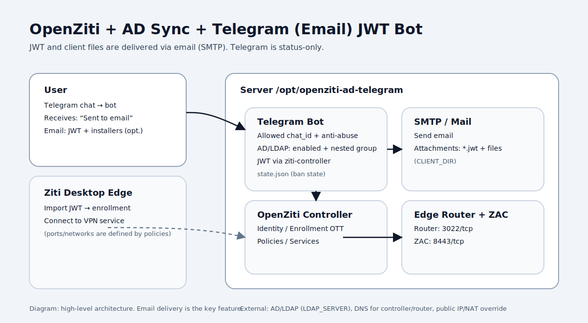
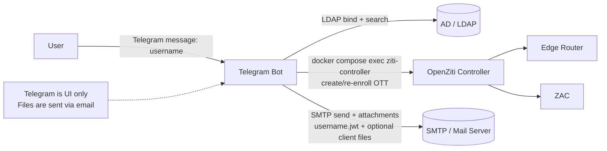
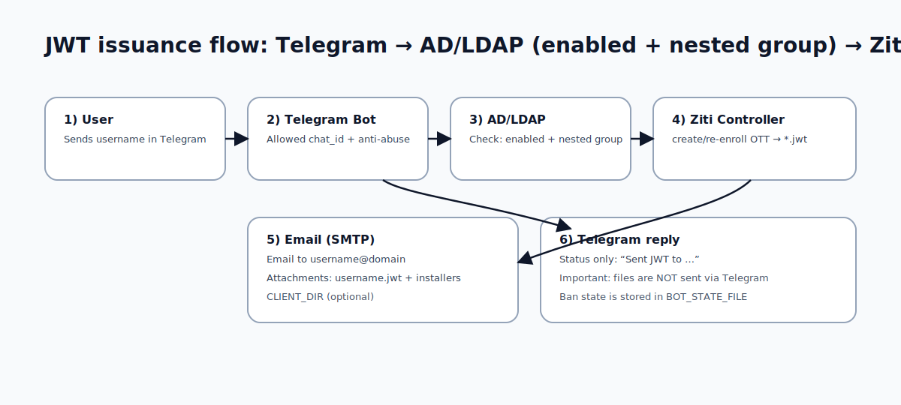
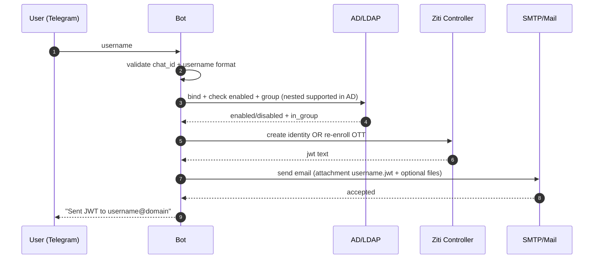

# OpenZiti + AD Sync + Telegram (Email) JWT Bot

[](README.md)
[](README_RU.md)

[](LICENSE)
[](https://github.com/kepan1n/OpenzitiADsyncTelegram/stargazers)
[](https://github.com/kepan1n/OpenzitiADsyncTelegram/issues)
[](https://github.com/kepan1n/OpenzitiADsyncTelegram/commits/main)

Infrastructure template to deploy **OpenZiti** (Docker Compose), sync users from **AD/LDAP**, and issue **enrollment JWT** on demand via **Telegram**.

Key idea:

- Telegram is used **only as a request UI**.
- **JWT and (optionally) client files are sent by email (SMTP) as attachments.**
- In Telegram the bot sends **status messages only** (no files).


---

## Contents

- [Quick start](#quick-start)
- [Architecture](#architecture)
- [JWT issuance flow](#jwt-issuance-flow)
- [Pinned vs Latest](#pinned-vs-latest)
- [Repository layout](#repository-layout)
- [Key files (details)](#key-files-details)
- [Super installer (super-install.sh) – step by step](#super-installer-super-installsh-step-by-step)
- [Configuration](#configuration)
- [Certificates (custom / Let’s Encrypt)](#certificates-custom-lets-encrypt)
- [systemd units](#systemd-units)
- [Client apps](#client-apps)
- [Useful commands](#useful-commands)
- [Security](#security)
- [Troubleshooting](#troubleshooting)
- [License](#license)

---

## Quick start

### Option 1: interactive “super installer” (recommended)


```bash
sudo bash -c "$(curl -fsSL https://raw.githubusercontent.com/kepan1n/OpenzitiADsyncTelegram/main/super-install.sh)"
```

> If you prefer: `git clone` first, then `sudo ./super-install.sh`.

### Option 2: manual

```bash
git clone <your-repo-url> /opt/openziti-ad-telegram
cd /opt/openziti-ad-telegram

cp .env.example .env
cp bot/.env.example bot/.env

# Edit .env and bot/.env
nano .env
nano bot/.env

# Install (Docker + systemd)
sudo ./install.sh

# Stable OpenZiti boot (controller -> init -> router)
./scripts/stable-up.sh
```

---

## Architecture

### Diagram (SVG)



### Diagram (Mermaid)



### Components

- **OpenZiti Controller** — identities/policies/services management.
- **OpenZiti Edge Router** — edge router for client connections.
- **ZAC (Ziti Admin Console)** — web console.
- **LDAP sync** (`scripts/sync-ldap-users.sh`) — sync users/groups from AD/LDAP.
- **Telegram bot** (`bot/telegram_jwt_bot.py`) — request handler + SMTP delivery.

---

## JWT issuance flow

### Diagram (SVG)



### Diagram (Mermaid)



In short:

1. User sends **username** in Telegram (typically `sAMAccountName`).
2. Bot checks access (allowed chat IDs + anti-abuse logic).
3. Bot validates the AD/LDAP user: **account enabled** (not disabled) and member of the **allowed group** (`LDAP_GROUP_DN`). **Nested groups** (AD) are supported via `LDAP_MATCHING_RULE_IN_CHAIN`.
4. Bot calls `ziti-controller` and performs **create/re-enroll enrollment OTT** → receives `*.jwt`.
5. Bot sends an email to `username@<USER_EMAIL_DOMAIN>`:
   - attachment `username.jwt`
   - **optional** — files from `CLIENT_DIR` (installers/instructions).
6. Telegram chat receives a status message: `Sent JWT to username@domain`.

---

## Repository layout

- `.env.example` — main configuration template (OpenZiti + AD/LDAP + network).
- `docker-compose.yml` — the active compose file (selected by `super-install.sh`).
- `docker-compose.pinned.yml` — pinned container versions (digests, reproducible).
- `docker-compose.latest.yml` — latest/variable tags.
- `startup.sh` — launch + preflight checks.
- `scripts/` — init/sync/certs scripts.
- `bot/.env.example` — Telegram bot configuration (Telegram + SMTP + whitelist).
- `install.sh` — non-interactive installer (Docker + systemd units for bot/timer).
- `super-install.sh` — interactive installer (whiptail) to populate `.env` / `bot/.env`.

---

## Pinned vs Latest

- **Pinned (digest)**: recommended for production. Predictable upgrades.
- **Latest (tags)**: convenient for testing. You may pull new versions on every deploy.

`super-install.sh` asks which mode to use and copies the selected file into `docker-compose.yml`.

---

## Key files (details)

### `docker-compose.latest.yml`

Compose variant that uses **tags** (typically `latest`) so you always pull the most recent images.

- Controller / router / init use: `${ZITI_IMAGE}:${ZITI_VERSION}` (from `.env`).
- ZAC uses: `openziti/zac:latest`.

### `docker-compose.pinned.yml`

Compose variant that uses **image digests** (`@sha256:...`) for a **fully reproducible** deployment.

- Good when you want stability and predictable upgrades.
- These digests can be pulled from the registry even if tags change in the future.
- Update strategy: explicitly update digests and commit the change.

### `docker-compose.yml`

The **active** Compose file used by `docker compose ...` commands.

- `super-install.sh` copies either `docker-compose.pinned.yml` or `docker-compose.latest.yml` into `docker-compose.yml`.

### `super-install.sh`

Interactive installer (whiptail).

- Clones/updates the repo into `/opt/openziti-ad-telegram`.
- Prompts which Compose mode to use:
  - **Pinned (digest)** → reproducible
  - **Latest (tags)** → always up-to-date
- Populates `.env` and `bot/.env`.
- Optionally starts the stack via `./scripts/stable-up.sh`.

### `README.md` / `README_RU.md`

- `README.md` is the default (English) README shown by GitHub.
- `README_RU.md` is the Russian version.
- Both have language switch badges at the top.

### Diagrams

There are separate SVG diagrams for English vs Russian documentation:

- English:
  - `assets/architecture.en.svg`
  - `assets/flow.en.svg`
- Russian:
  - `assets/architecture.svg`
  - `assets/flow.svg`

---

## Super installer (super-install.sh) – step by step

`super-install.sh` is an interactive installer that prepares the host, configures the project, and can start the stack.

1. **Requires root** (`sudo`).
2. **Bootstraps the system**:
   - installs `git` if missing
   - installs Docker if missing
3. **Auto-fixes AppArmor NUL-byte corruption** (if detected under `/etc/apparmor.d/tunables/home.d/`):
   - reinstalls AppArmor packages (best-effort)
   - removes `0x00` bytes from `home.d/*`
   - restarts `apparmor` and `docker`
   - prints AppArmor/Docker logs if services still fail
4. **Clones or updates** the repo to the install directory (default `/opt/openziti-ad-telegram`).
5. **Asks which Compose mode to use**:
   - pinned digests (`docker-compose.pinned.yml`) or
   - latest tags (`docker-compose.latest.yml`)
   and copies the selected file to `docker-compose.yml`.
6. Ensures `.env` and `bot/.env` exist (copies from `*.example` if missing).
7. Prompts for OpenZiti + network + LDAP settings and writes them to `.env`.
8. (Optional / advanced mode) Prompts for Telegram + SMTP settings and writes them to `bot/.env`.
9. Optionally starts services via `./scripts/stable-up.sh` and applies certs via `./scripts/auto-update-certs.sh`.

---

## Configuration

### 1) `.env` (OpenZiti + LDAP)

`.env` contains:

- controller/router addresses and ports (FQDN + advertised + NAT override)
- admin credentials (`ZITI_USER`, `ZITI_PWD`)
- LDAP settings (`LDAP_SERVER`, `LDAP_BIND_DN`, `LDAP_BIND_PASSWORD`, `LDAP_BASE_DN`, `LDAP_GROUP_DN`)

Notes:

- **`LDAP_BIND_PASSWORD` is required** for both the bot validation and LDAP sync.
- For NAT scenarios use `ZITI_CTRL_EDGE_IP_OVERRIDE` / `ZITI_ROUTER_IP_OVERRIDE`.

### 2) `bot/.env` (Telegram + SMTP)

The bot **does not send JWT/files in Telegram** — SMTP is required.

Minimal set:

- `TELEGRAM_BOT_TOKEN`
- `SMTP_HOST`, `SMTP_PORT`
- `SMTP_USER`, `SMTP_PASS`, `SMTP_FROM`
- `USER_EMAIL_DOMAIN` — email domain for delivery: `username@USER_EMAIL_DOMAIN`
- `TELEGRAM_ALLOWED_CHAT_IDS` — whitelist (recommended)
- `CLIENT_DIR` — optional folder to attach extra files to the email
- `BOT_STATE_FILE` — bot state (ban list/counters/rate-limits). Default: `data/bot-state.json`
- `LDAP_NESTED_GROUPS` — enable nested AD group membership check (AD only). Default: `true`
- `BOT_RATE_LIMIT_WINDOW_SECONDS`, `BOT_RATE_LIMIT_MAX` — per-username rate limit
- `BOT_GLOBAL_RATE_LIMIT_WINDOW_SECONDS`, `BOT_GLOBAL_RATE_LIMIT_MAX` — global rate limit across ALL chat IDs

---

## Certificates (custom / Let’s Encrypt)

Place certificates into `/opt/openziti-ad-telegram/certs/`:

- `fullchain.cer`
- `cert.key`
- `chain.cer`

Apply / verify:

```bash
cd /opt/openziti-ad-telegram
./scripts/auto-update-certs.sh
```

The script:

- validates the certs
- checks key matches
- applies to `/persistent/pki/custom`
- restarts controller/router
- skips if nothing changed

---

## systemd units

Installed by `install.sh`:

- `ziti-telegram-bot.service`
- `ziti-ldap-sync.service`
- `ziti-ldap-sync.timer` (every 30 minutes)

---

## Client apps

- Android (Ziti Mobile Edge): https://play.google.com/store/apps/details?id=org.openziti.mobile
- iOS (Ziti Mobile Edge): https://apps.apple.com/us/app/ziti-mobile-edge/id1460484353
- Windows (Ziti Desktop Edge): https://github.com/openziti/desktop-edge-win/releases/
- macOS (Ziti Desktop Edge): https://apps.apple.com/us/app/ziti-desktop-edge/id1460484572

---

## Useful commands

```bash
# Container status
cd /opt/openziti-ad-telegram
docker compose ps

# Logs
docker compose logs -f

# Run LDAP sync manually
docker compose exec -T ziti-controller bash /scripts/sync-ldap-users.sh

# Check controller API
curl -k https://<controller-host>:1280/version
```

---

## Security

- Never commit:
  - `.env`, `bot/.env`
  - `certs/*`
  - `data/*`, `logs/*`
- Use a dedicated service account for LDAP bind.
- Restrict Telegram access via `TELEGRAM_ALLOWED_CHAT_IDS`.
- Rotate secrets: `ZITI_PWD`, `LDAP_BIND_PASSWORD`, `SMTP_PASS`, `TELEGRAM_BOT_TOKEN`.

---

## Troubleshooting

### Windows: automatically set DNS on the Ziti interface at startup

If Ziti creates a virtual adapter and DNS needs to be forced on it after boot, you can register a Scheduled Task as SYSTEM.

```powershell
$action = New-ScheduledTaskAction -Execute "powershell.exe" -Argument '-NoProfile -ExecutionPolicy Bypass -Command " $pattern=''ziti|wintun|tun''; $primary=''10.0.1.10''; $secondary=''10.0.0.1''; $adapter = Get-NetAdapter | Where-Object { ($_.Name -match $pattern -or $_.InterfaceDescription -match $pattern) -and $_.Status -eq ''Up'' } | Select -First 1; if ($adapter) { Set-DnsClientServerAddress -InterfaceIndex $adapter.ifIndex -ServerAddresses @($primary,$secondary); Write-Output \"DNS set on $($adapter.Name)\" } "'
$trigger = New-ScheduledTaskTrigger -AtStartup  # or -AtLogOn
$principal = New-ScheduledTaskPrincipal -UserId "NT AUTHORITY\SYSTEM" -LogonType ServiceAccount -RunLevel Highest
$settings = New-ScheduledTaskSettingsSet -AllowStartIfOnBatteries -DontStopIfGoingOnBatteries -ExecutionTimeLimit (New-TimeSpan -Minutes 10)
Register-ScheduledTask -TaskName "Set-Ziti-DNS-On-Start" -Action $action -Trigger $trigger -Principal $principal -Settings $settings -Description "Auto-set DNS on Ziti interface"
```

> Adjust `$primary/$secondary` and the `$pattern` if your adapter name differs.


### Docker fails to start containers: AppArmor docker-default profile could not be loaded

If you see an error like:

- `AppArmor enabled on system but the docker-default profile could not be loaded`
- `apparmor_parser ... Lexer found unexpected character: '' (0x0)`

It usually means an AppArmor profile file contains **NUL bytes** (0x00), often under:

- `/etc/apparmor.d/tunables/home.d/`

Fix (backup + remove NULs), then restart AppArmor and Docker:

```bash
sudo cp -a /etc/apparmor.d/tunables/home.d/ubuntu /etc/apparmor.d/tunables/home.d/ubuntu.bak.$(date +%F_%H%M%S)
sudo perl -i -pe 's/\x00//g' /etc/apparmor.d/tunables/home.d/ubuntu
sudo systemctl restart apparmor
sudo systemctl restart docker
```

Note: `super-install.sh` includes an automatic check for this issue and tries to repair AppArmor/Docker if NUL bytes are detected.

### Bot won’t start

Most common cause: missing required env vars (Telegram token, SMTP, LDAP).

### JWT goes to the wrong place

Check:

- `USER_EMAIL_DOMAIN`
- `SMTP_FROM`
- `SMTP_HOST/PORT/TLS/SSL`

### AD check doesn’t work

Check:

- `LDAP_SERVER`
- `LDAP_BIND_DN`
- `LDAP_BIND_PASSWORD`
- `LDAP_BASE_DN`

---

## License

This infra template is provided “as is”.
OpenZiti: Apache-2.0.
