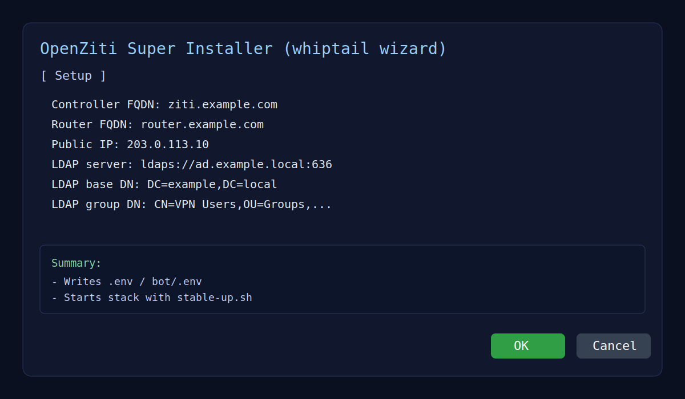
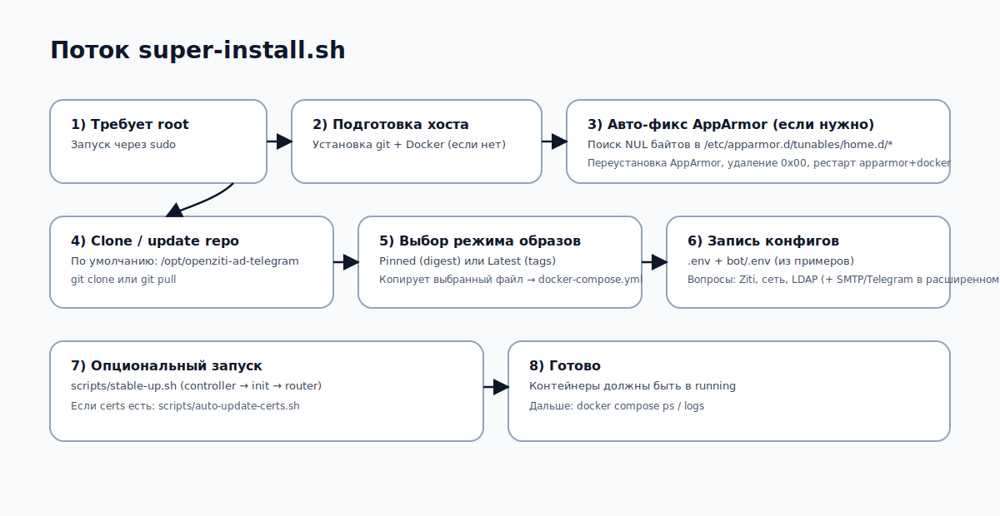
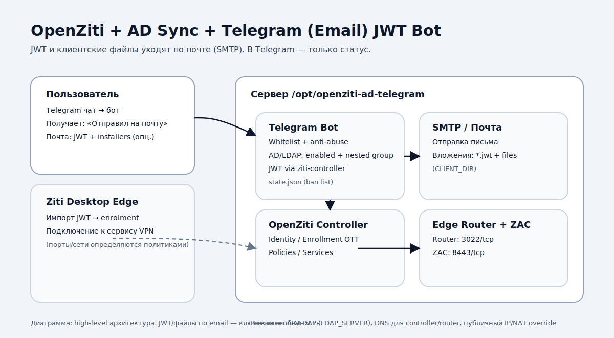
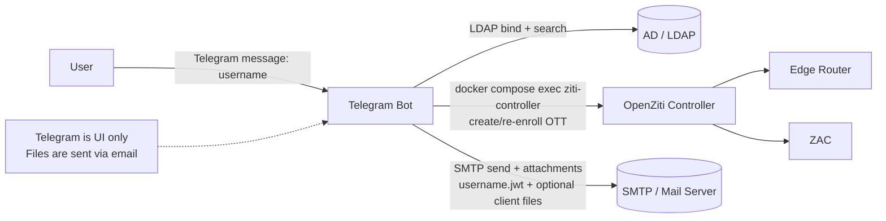
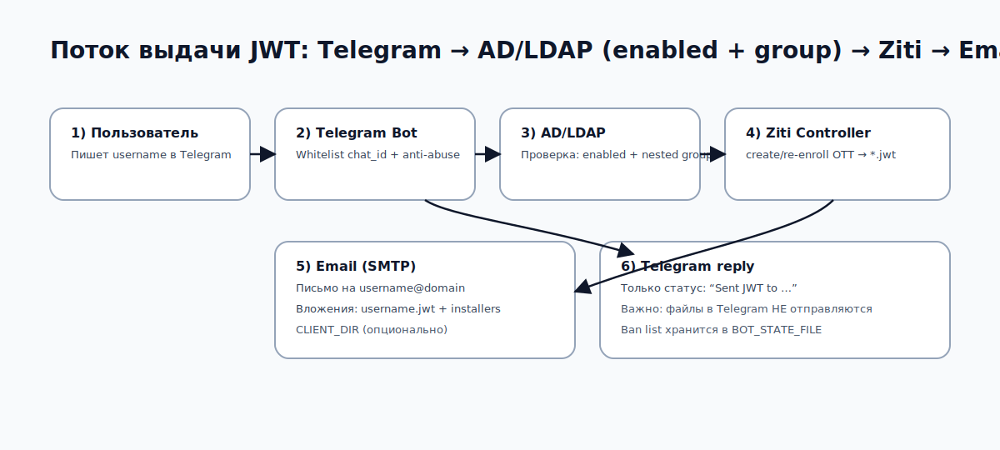
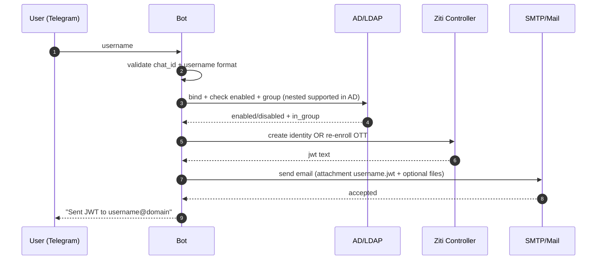

# OpenZiti + AD Sync + Telegram (Email) JWT Bot

[](README.md)
[](README_RU.md)

[](LICENSE)
[](https://github.com/kepan1n/OpenzitiADsyncTelegram/stargazers)
[](https://github.com/kepan1n/OpenzitiADsyncTelegram/issues)
[](https://github.com/kepan1n/OpenzitiADsyncTelegram/commits/main)

Шаблон инфраструктурного проекта для развёртывания **OpenZiti** (Docker Compose), синхронизации пользователей из **AD/LDAP** и выдачи **enrollment JWT** по запросу через **Telegram**.

Ключевая особенность:

- Telegram используется **как интерфейс запроса**.
- **JWT и (опционально) клиентские файлы отправляются на почту (SMTP) как вложения.**
- В Telegram-чат бот отправляет **только статус** (без файлов).


---

## Содержание

- [Архитектура](#архитектура)
- [Поток выдачи JWT](#поток-выдачи-jwt)
- [Структура репозитория](#структура-репозитория)
- [Ключевые файлы (подробнее)](#ключевые-файлы-подробнее)
- [Быстрый старт](#быстрый-старт)
- [Конфигурация](#конфигурация)
- [Сертификаты (custom / Let’s Encrypt)](#сертификаты-custom--lets-encrypt)
- [systemd units](#systemd-units)
- [Полезные команды](#полезные-команды)
- [Безопасность](#безопасность)
- [Troubleshooting](#troubleshooting)

---

## Быстрый старт

### Вариант 1: интерактивный «супер-скрипт» (рекомендуется)





```bash
sudo bash -c "$(curl -fsSL https://raw.githubusercontent.com/kepan1n/OpenzitiADsyncTelegram/main/super-install.sh)"
```

> Если удобнее: сначала `git clone`, затем `sudo ./super-install.sh`.

### Вариант 2: вручную

```bash
git clone <your-repo-url> /opt/openziti-ad-telegram
cd /opt/openziti-ad-telegram

cp .env.example .env
cp bot/.env.example bot/.env

# Заполни .env и bot/.env
nano .env
nano bot/.env

# Автоустановка (Docker + systemd)
sudo ./install.sh

# Стабильный запуск OpenZiti (controller -> init -> router)
./scripts/stable-up.sh
```

---

## Архитектура

### Diagram (SVG)



### Diagram (Mermaid)



### Компоненты

- **OpenZiti Controller** — управление идентичностями, политиками, сервисами.
- **OpenZiti Edge Router** — edge-роутер для клиентских соединений.
- **ZAC (Ziti Admin Console)** — веб-консоль.
- **LDAP sync** (`scripts/sync-ldap-users.sh`) — синхронизация пользователей/группы из AD/LDAP.
- **Telegram bot** (`bot/telegram_jwt_bot.py`) — обработчик запросов + SMTP-отправка.

---

## Поток выдачи JWT

### Diagram (SVG)



### Diagram (Mermaid)



Кратко:

1. Пользователь пишет в Telegram **username** (обычно `sAMAccountName`).
2. Бот проверяет доступ (whitelist chat IDs, анти-абуз логика).
3. Бот проверяет пользователя в AD/LDAP: **аккаунт включён** (not disabled) и состоит в **разрешённой группе** (`LDAP_GROUP_DN`). Поддерживаются **nested группы** (AD) через `LDAP_MATCHING_RULE_IN_CHAIN`.
4. Бот обращается к `ziti-controller` и делает **create/re-enroll enrollment OTT** → получает `*.jwt`.
5. Бот отправляет email на `username@<USER_EMAIL_DOMAIN>`:
   - вложение `username.jwt`
   - **опционально** — файлы из `CLIENT_DIR` (например, installers/инструкции).
6. В Telegram приходит подтверждение вида: `Sent JWT to username@domain`.

---

## Структура репозитория

- `.env.example` — основной шаблон конфигурации (OpenZiti + AD/LDAP + сеть).
- `docker-compose.yml` — текущий compose-файл (выбирается супер-скриптом).
- `docker-compose.pinned.yml` — pinned версии контейнеров (digest, воспроизводимо).
- `docker-compose.latest.yml` — latest / переменные теги.
- `startup.sh` — запуск и preflight-проверки.
- `scripts/` — инициализация/синхронизация/сертификаты.
- `bot/.env.example` — конфиг Telegram-бота (Telegram + SMTP + whitelist).
- `install.sh` — автоустановка (Docker + systemd unit’ы для bot/timer).
- `super-install.sh` — интерактивный установщик (whiptail), заполняет `.env`/`bot/.env`.

---

## Pinned vs Latest

- **Pinned (digest)**: рекомендовано для продакшена. Обновления контролируемые и воспроизводимые.
- **Latest (tags)**: удобно для тестов, но версии могут меняться при каждом деплое.

`super-install.sh` спрашивает режим и копирует выбранный файл в `docker-compose.yml`.

---

## Ключевые файлы (подробнее)

### `docker-compose.latest.yml`

Вариант compose, который использует **теги** (обычно `latest`) — будет тянуть самые свежие образы.

- Controller / router / init: `${ZITI_IMAGE}:${ZITI_VERSION}` (из `.env`).
- ZAC: `openziti/zac:latest`.

### `docker-compose.pinned.yml`

Вариант compose, который использует **digest’ы образов** (`@sha256:...`) для **полной воспроизводимости**.

- Полезно для стабильной эксплуатации и контролируемых обновлений.
- Эти digest’ы можно тянуть из registry даже если теги изменятся в будущем.
- Стратегия обновления: явно обновлять digest’ы и коммитить изменения.

### `docker-compose.yml`

**Активный** compose-файл, который используют все команды `docker compose ...`.

- `super-install.sh` копирует выбранный вариант (`pinned` или `latest`) в `docker-compose.yml`.

### `super-install.sh`

Интерактивный установщик (whiptail).

- Клонирует/обновляет репозиторий в `/opt/openziti-ad-telegram`.
- Спрашивает режим образов:
  - **Pinned (digest)** → воспроизводимо
  - **Latest (tags)** → всегда свежее
- Заполняет `.env` и `bot/.env`.
- Опционально запускает стек через `./scripts/stable-up.sh`.

### `README.md` / `README_RU.md`

- `README.md` — английский README (по умолчанию на GitHub).
- `README_RU.md` — русская версия.
- В обоих README есть кнопки переключения языков.

### Диаграммы

SVG-диаграммы разделены на английские и русские:

- English:
  - `assets/architecture.en.svg`
  - `assets/flow.en.svg`
- Русские:
  - `assets/architecture.svg`
  - `assets/flow.svg`

---

## Super installer (super-install.sh) — по шагам

`super-install.sh` — интерактивный установщик, который готовит хост, конфигурирует проект и (по желанию) запускает стек.

1. **Требует root** (`sudo`).
2. **Готовит систему**:
   - ставит `git`, если его нет
   - ставит Docker, если его нет
3. **Авто-фикс AppArmor NUL-byte corruption** (если найдено в `/etc/apparmor.d/tunables/home.d/`):
   - переустанавливает пакеты AppArmor (best-effort)
   - удаляет байты `0x00` из `home.d/*`
   - перезапускает `apparmor` и `docker`
   - печатает логи AppArmor/Docker, если сервисы не поднялись
4. **Клонирует или обновляет** репозиторий в каталог установки (по умолчанию `/opt/openziti-ad-telegram`).
5. **Спрашивает режим Compose**:
   - pinned digests (`docker-compose.pinned.yml`) или
   - latest tags (`docker-compose.latest.yml`)
   и копирует выбранный файл в `docker-compose.yml`.
6. Гарантирует наличие `.env` и `bot/.env` (копирует из `*.example`, если их нет).
7. Запрашивает параметры OpenZiti + сеть + LDAP и пишет их в `.env`.
8. (Опционально / расширенный режим) Запрашивает Telegram + SMTP и пишет в `bot/.env`.
9. По желанию запускает сервисы через `./scripts/stable-up.sh` и применяет сертификаты через `./scripts/auto-update-certs.sh`.

---

## Конфигурация

### 1) `.env` (OpenZiti + LDAP)

В `.env` задаются:

- адреса/порты controller/router (FQDN + advertised + NAT override)
- admin credentials (`ZITI_USER`, `ZITI_PWD`)
- LDAP параметры (`LDAP_SERVER`, `LDAP_BIND_DN`, `LDAP_BIND_PASSWORD`, `LDAP_BASE_DN`, `LDAP_GROUP_DN`)

Важно:

- **`LDAP_BIND_PASSWORD` обязателен** для проверки пользователя ботом и для LDAP sync.
- Для NAT сценариев используйте `ZITI_CTRL_EDGE_IP_OVERRIDE` / `ZITI_ROUTER_IP_OVERRIDE`.

### 2) `bot/.env` (Telegram + SMTP)

Бот **не отправляет JWT/файлы в Telegram** — ему нужен SMTP.

Минимальный набор:

- `TELEGRAM_BOT_TOKEN`
- `SMTP_HOST`, `SMTP_PORT`
- `SMTP_USER`, `SMTP_PASS`, `SMTP_FROM`
- `USER_EMAIL_DOMAIN` — домен, куда бот отправляет письма: `username@USER_EMAIL_DOMAIN`
- `TELEGRAM_ALLOWED_CHAT_IDS` — whitelist (рекомендуется)
- `CLIENT_DIR` — каталог файлов, которые добавятся в письмо как вложения (опционально)
- `BOT_STATE_FILE` — путь к файлу состояния бота (бан-лист/счётчики/rate-limit). По умолчанию: `data/bot-state.json`
- `LDAP_NESTED_GROUPS` — включить проверку nested-групп в AD (только AD). По умолчанию: `true`
- `BOT_RATE_LIMIT_WINDOW_SECONDS`, `BOT_RATE_LIMIT_MAX` — rate limit по username
- `BOT_GLOBAL_RATE_LIMIT_WINDOW_SECONDS`, `BOT_GLOBAL_RATE_LIMIT_MAX` — глобальный лимит на все chat_id суммарно

---

## Сертификаты (custom / Let’s Encrypt)

Положить сертификаты в `/opt/openziti-ad-telegram/certs/`:

- `fullchain.cer`
- `cert.key`
- `chain.cer`

Применение/проверка:

```bash
cd /opt/openziti-ad-telegram
./scripts/auto-update-certs.sh
```

Скрипт:

- валидирует сертификаты
- проверяет соответствие ключа
- применяет в `/persistent/pki/custom`
- перезапускает controller/router
- пропускает выполнение, если изменений нет

---

## systemd units

Когда ставишь через `install.sh`:

- `ziti-telegram-bot.service`
- `ziti-ldap-sync.service`
- `ziti-ldap-sync.timer` (каждые 30 минут)

---

## Клиентские приложения

- Android (Ziti Mobile Edge): https://play.google.com/store/apps/details?id=org.openziti.mobile
- iOS (Ziti Mobile Edge): https://apps.apple.com/us/app/ziti-mobile-edge/id1460484353
- Windows (Ziti Desktop Edge): https://github.com/openziti/desktop-edge-win/releases/
- macOS (Ziti Desktop Edge): https://apps.apple.com/us/app/ziti-desktop-edge/id1460484572

---

## Полезные команды

```bash
# Статус контейнеров
cd /opt/openziti-ad-telegram
docker compose ps

# Логи
docker compose logs -f

# Ручной запуск LDAP sync
docker compose exec -T ziti-controller bash /scripts/sync-ldap-users.sh

# Проверка controller API
curl -k https://<controller-host>:1280/version
```

---

## Безопасность

- Никогда не коммитьте:
  - `.env`, `bot/.env`
  - `certs/*`
  - `data/*`, `logs/*`
- Используйте отдельный service account для LDAP bind.
- Ограничьте Telegram доступ через `TELEGRAM_ALLOWED_CHAT_IDS`.
- Ротируйте секреты: `ZITI_PWD`, `LDAP_BIND_PASSWORD`, `SMTP_PASS`, `TELEGRAM_BOT_TOKEN`.

---

## Troubleshooting

### Windows: автоматически выставлять DNS на интерфейсе Ziti при старте

Если Ziti поднимает виртуальный адаптер и после загрузки нужно принудительно задавать DNS именно на нём — можно создать Scheduled Task от SYSTEM.

```powershell
$action = New-ScheduledTaskAction -Execute "powershell.exe" -Argument '-NoProfile -ExecutionPolicy Bypass -Command " $pattern=''ziti|wintun|tun''; $primary=''10.0.1.10''; $secondary=''10.0.0.1''; $adapter = Get-NetAdapter | Where-Object { ($_.Name -match $pattern -or $_.InterfaceDescription -match $pattern) -and $_.Status -eq ''Up'' } | Select -First 1; if ($adapter) { Set-DnsClientServerAddress -InterfaceIndex $adapter.ifIndex -ServerAddresses @($primary,$secondary); Write-Output \"DNS set on $($adapter.Name)\" } "'
$trigger = New-ScheduledTaskTrigger -AtStartup  # or -AtLogOn
$principal = New-ScheduledTaskPrincipal -UserId "NT AUTHORITY\SYSTEM" -LogonType ServiceAccount -RunLevel Highest
$settings = New-ScheduledTaskSettingsSet -AllowStartIfOnBatteries -DontStopIfGoingOnBatteries -ExecutionTimeLimit (New-TimeSpan -Minutes 10)
Register-ScheduledTask -TaskName "Set-Ziti-DNS-On-Start" -Action $action -Trigger $trigger -Principal $principal -Settings $settings -Description "Auto-set DNS on Ziti interface"
```

> Поменяй `$primary/$secondary` и `$pattern`, если у адаптера другое имя/описание.


### Docker не запускает контейнеры: AppArmor docker-default profile could not be loaded

Если видишь ошибку вида:

- `AppArmor enabled on system but the docker-default profile could not be loaded`
- `apparmor_parser ... Lexer found unexpected character: '' (0x0)`

Чаще всего это означает, что в одном из файлов AppArmor есть **NUL байты** (0x00), обычно в:

- `/etc/apparmor.d/tunables/home.d/`

Фикс (бэкап + убрать NUL), затем перезапустить AppArmor и Docker:

```bash
sudo cp -a /etc/apparmor.d/tunables/home.d/ubuntu /etc/apparmor.d/tunables/home.d/ubuntu.bak.$(date +%F_%H%M%S)
sudo perl -i -pe 's/\x00//g' /etc/apparmor.d/tunables/home.d/ubuntu
sudo systemctl restart apparmor
sudo systemctl restart docker
```

Примечание: `super-install.sh` содержит автоматическую проверку этой проблемы и пытается починить AppArmor/Docker, если найдены NUL-байты.


### Бот не стартует

Обычно причина — не заполнены обязательные переменные (`TELEGRAM_BOT_TOKEN`, SMTP, LDAP).

### JWT уходит не туда

Проверь:

- `USER_EMAIL_DOMAIN`
- `SMTP_FROM`
- `SMTP_HOST/PORT/TLS/SSL`

### AD проверка не работает

Проверь:

- `LDAP_SERVER`
- `LDAP_BIND_DN`
- `LDAP_BIND_PASSWORD`
- `LDAP_BASE_DN`

---

## Лицензия

Infra-шаблон предоставляется "as is".
OpenZiti: Apache-2.0.
